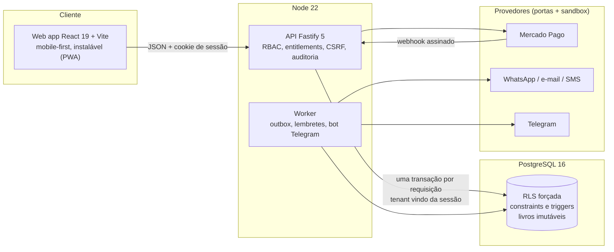

# Clínica One

**Plataforma SaaS multiempresa de gestão clínica**, em português do Brasil, feita para clínicas e consultórios (com módulo de odontologia): agenda, pacientes, prontuário, financeiro, pagamentos online, estoque, compras, CRM, indicadores e operação da plataforma.

> **Status:** projeto funcional em ambiente de desenvolvimento, com testes automatizados e CI. **Não está pronto para dados reais de pacientes**: integrações externas (WhatsApp, e-mail, SMS, NFS-e, assinatura eletrônica) rodam em modo simulado (sandbox) e nenhuma conformidade (LGPD, CFM, CFO) é declarada sem revisão especializada. Veja [Limites conhecidos](#limites-conhecidos).

    

## Destaques técnicos

- **Isolamento entre clínicas decidido pelo banco.** Multi-tenancy em banco compartilhado com *Row Level Security* forçada, chaves estrangeiras compostas `(tenant_id, id)` e três papéis de banco sem `BYPASSRLS`. Um teste falha se surgir tabela com `tenant_id` sem RLS. O painel da plataforma (Master) não consegue ler dados clínicos, e isso é provado em teste.
- **Regras de negócio protegidas na camada de dados.** Conflito de horário (profissional, paciente e sala) resolvido por restrição de exclusão do PostgreSQL, inclusive sob concorrência. Saldo de estoque que nunca fica negativo, períodos de repasse sem sobreposição e transições de status são garantidos por constraints e triggers, não só pelo código.
- **Registros imutáveis.** Prontuário assinado só muda por adendo justificado. Financeiro, estoque e odontograma são livros de movimentos append-only; documentos anexados só podem ser arquivados com motivo.
- **Segurança.** RBAC deny-by-default, sessões revogáveis no servidor, MFA (TOTP de uso único) com segredos cifrados em repouso (AES-256-GCM), limite de tentativas no banco, proteção CSRF, auditoria de leituras sensíveis, validação de uploads pelo conteúdo do arquivo e dados sensíveis removidos de alertas.
- **Integrações com portas e adaptadores.** Cada provedor externo (pagamentos, mensageria, alertas) tem uma interface, um adaptador real e um *sandbox*; o catálogo é único e o sistema roda inteiro sem rede. Mensagens saem por *outbox* transacional, com retry, backoff e dead-letter.
- **Idempotência.** Lançamentos financeiros, movimentos de estoque, webhooks de pagamento e estornos usam chaves de idempotência, então repetir uma chamada não duplica nada.
- **Operação.** Alertas de erro por Telegram dizendo qual componente e qual clínica falhou, com o arquivo e a linha de origem, e comandos de consulta (`/status`, `/erros`, `/fila`). Backup e restore validados por script. Deploy por Docker com atualização automática (Watchtower) a partir de imagem publicada no GHCR pelo CI.

## Funcionalidades

| Área | O que tem |
|---|---|
| **Pacientes** | cadastro e busca, alerta clínico, aviso e mesclagem de duplicados, responsáveis, exportação de dados, solicitações de privacidade do titular, anexos e documentos (PDF/imagens) |
| **Agenda** | dia, semana e mês; encaixe, bloqueios, séries semanais, lista de espera, fila da recepção (chegada, chamada, atendimento, conclusão) |
| **Prontuário** | rascunho, assinatura, imutabilidade, adendos, leitura auditada |
| **Odontologia** | odontograma permanente e decíduo por face com histórico, plano de tratamento, orçamento com aceite, baixa automática de materiais ao concluir o procedimento |
| **Financeiro** | cobranças e pagamentos, estorno total e parcial, caixa com sangria e suprimento, descontos com aprovação, recibos, contas a pagar, comissões e repasses |
| **Pagamentos online** | Pix, link de pagamento com parcelamento e estorno via Mercado Pago, com conciliação por webhook assinado |
| **Estoque e compras** | lotes e validade (saída FEFO), inventário por contagem, fornecedores, pedidos de compra com recebimento parcial |
| **CRM** | funil de leads, conversão em paciente e agendamento direto do lead |
| **Indicadores** | painel por período e exportação CSV |
| **Equipe** | papéis (dono, admin, gerente de unidade, recepção, profissional, financeiro, estoque, marketing, auditor), escopo por unidade na agenda, MFA |
| **Plataforma (Master)** | criar e suspender clínicas, planos e funcionalidades por clínica, auditoria, saúde das integrações, histórico de alertas |

O que ainda falta e o que depende de contratação de terceiros está em [`docs/BACKLOG.md`](docs/BACKLOG.md) e [`PENDENCIAS.md`](PENDENCIAS.md).

## Arquitetura



Decisões registradas em [`docs/adr/`](docs/adr) (stack, multi-tenancy, identidade, deploy) e ameaças em [`docs/THREAT-MODEL.md`](docs/THREAT-MODEL.md).

### Decisões que valem destacar

| Decisão | Motivo |
|---|---|
| RLS no PostgreSQL em vez de filtrar `tenant_id` no código | Um esquecimento de `WHERE` no código não vaza dados; o banco recusa. |
| Uma transação por requisição com o tenant definido a partir da sessão | O cliente nunca informa a qual clínica pertence. |
| Regras críticas em constraints e triggers | Valem mesmo para scripts, migrations e bugs futuros. |
| Livros de movimentos imutáveis, saldo derivado | Auditoria completa e correção só por lançamento compensatório. |
| Ports/adapters com sandbox para tudo que é externo | Desenvolvimento e testes sem rede nem credenciais; troca de provedor sem tocar nas regras. |
| Valores em centavos (inteiros) e datas no fuso de São Paulo | Sem erro de arredondamento nem de virada de dia. |

## Tecnologias

| Camada | Escolhas |
|---|---|
| Linguagem | TypeScript em todo o projeto (servidor e web), SQL (PL/pgSQL em triggers), CSS, Shell |
| Back-end | Node 22, Fastify 5, `pg`, zod 4 |
| Banco | PostgreSQL 16, migrations versionadas com checksum |
| Front-end | React 19, Vite 7, CSS próprio mobile-first |
| Testes | Vitest (264 testes contra PostgreSQL real), Playwright (E2E em celular e desktop) |
| Infra | Docker e Docker Compose, GitHub Actions (verificação, publicação da imagem no GHCR), Watchtower |

## Como rodar

### Com Docker (um comando)

Passo a passo para Windows, macOS e Linux, com acessos de demonstração: [`docs/ACESSO.md`](docs/ACESSO.md).

### Sem Docker (Node 22 e PostgreSQL 16 locais)

```bash
npm install
npm run setup:dev     # cria banco e papéis de dev, aplica migrations, cria dados DEMO fictícios e gera o frontend
npm start             # http://localhost:3000
```

Acessos de demonstração (todos fictícios, somente desenvolvimento): clínica `demo`, usuário `dono@demo.demo`, senha `Demo@12345`. Painel Master em `/#/master`.

### Comandos

| Comando | O que faz |
|---|---|
| `npm run check` | typecheck (servidor e web) e todos os testes |
| `npm test` | testes de integração contra PostgreSQL real |
| `npm run e2e` | fluxo completo no Chromium, em celular e desktop |
| `npm run drill` | backup, restore em banco temporário e validação de dados, RLS e isolamento |
| `npm run build` | typecheck e build do frontend |
| `npm run worker` | processo de segundo plano (mensagens, lembretes, bot) |

## Estrutura

```
src/
  server/      API (rotas por domínio, RBAC, sessões, auditoria)
  worker/      outbox de mensagens, lembretes e bot do Telegram
  modules/     regras de domínio (pacientes, financeiro, pagamentos, comunicação, planos)
  integrations/ portas, adaptadores e sandbox dos provedores
  ops/         alertas operacionais
  db/          conexão, contexto de tenant, migrations
web/src/       aplicação React (uma página por área)
migrations/    27 migrations SQL versionadas
tests/         testes de integração e de isolamento
docs/          backlog, conformidade, ameaças, ADRs, guias de integração
```

## Testes e qualidade

- **264 testes de integração** executam contra um PostgreSQL real, incluindo isolamento entre clínicas, concorrência de agendamento, idempotência de pagamentos e imutabilidade de registros.
- **E2E com Playwright** percorre os fluxos principais em celular e desktop e falha em erro de console, violação de CSP, resposta 5xx ou rolagem horizontal.
- **CI** (GitHub Actions) roda a verificação completa a cada push e publica a imagem Docker.

## Limites conhecidos

- Integrações reais com WhatsApp, e-mail, SMS, NFS-e e assinatura eletrônica dependem de contratação; estão implementadas em sandbox. O Mercado Pago está escrito conforme a documentação, mas ainda não foi validado com credenciais reais.
- Convênios e faturamento TISS estão bloqueados globalmente nesta fase.
- Escopo por unidade vale hoje só para a agenda; pacientes, estoque e CRM pertencem à clínica inteira.
- Sem deploy público com HTTPS e domínio; acesso por Docker local.
- Conformidade (LGPD, CFM, CFO) exige revisão especializada antes de qualquer uso com dados reais: leia [`docs/ACEITE-FASE-1.md`](docs/ACEITE-FASE-1.md) e [`docs/CONFORMIDADE.md`](docs/CONFORMIDADE.md).

## Documentação

[`docs/ACESSO.md`](docs/ACESSO.md) · [`docs/AMBIENTE.md`](docs/AMBIENTE.md) · [`docs/BACKLOG.md`](docs/BACKLOG.md) · [`docs/CONFORMIDADE.md`](docs/CONFORMIDADE.md) · [`docs/INTEGRACOES.md`](docs/INTEGRACOES.md) · [`docs/PAGAMENTOS.md`](docs/PAGAMENTOS.md) · [`docs/ALERTAS.md`](docs/ALERTAS.md) · [`docs/THREAT-MODEL.md`](docs/THREAT-MODEL.md) · [`docs/adr/`](docs/adr)
